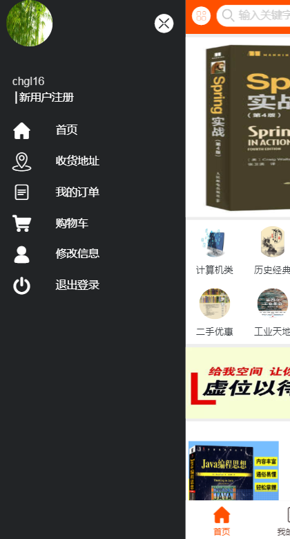
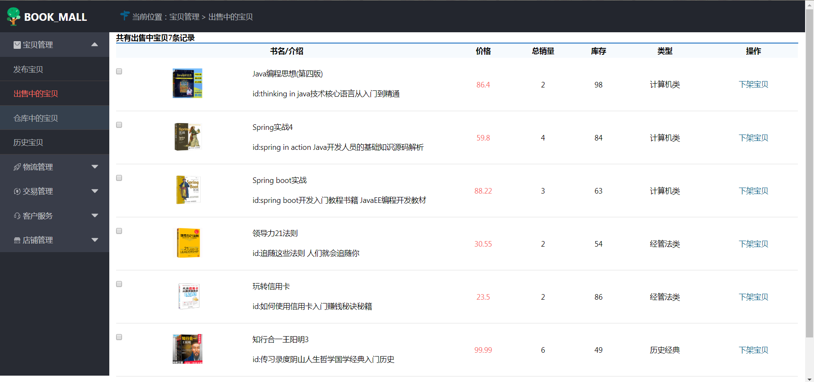
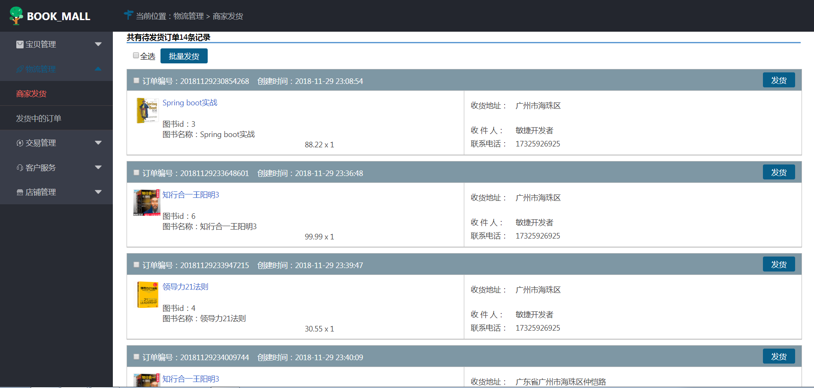
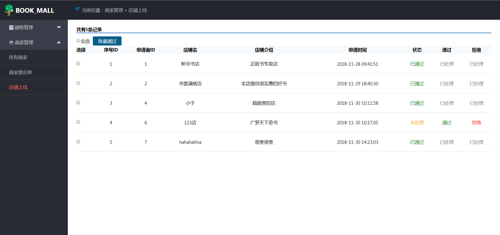

# shopping-platform
    基于SSM开发的移动购物书城
    支付使用支付宝沙箱API
    
## 环境
 

## 配置
```shell
mvn package
```

## 效果
#### 1.客户端页面
 &nbsp;&nbsp;

<hr>

 &nbsp;&nbsp;

<hr>

 &nbsp;&nbsp;

<hr>


#### 2.后台管理页面
 &nbsp;&nbsp;

<hr>


## 注意


## 相关链接
1. [=> 项目首页](http://www.cglzwz.top/html/view/)  
2. [=> 开发者文档](doc)
